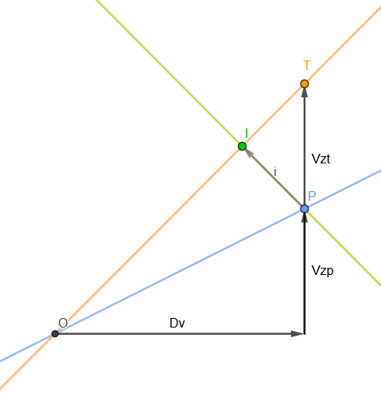

# Schema

.

# Legend

$O$: origin from which we begin to look at a thermal particle and the paraglider pilot  

$P$: pilot's position after making one turn  

$T$: thermal particle's position after the pilot made one turn  

$(OT)$: pilot's trajectory  

$(OP)$: thermal particle's trajectory. Considered as the optimal trajectory for climbing  

$\vec{OP}$: vector of the pilot's movement  

$\vec{OT}$: vector of the thermal particle's movement

$\vec{Dv}$: horizontal component of $\vec{OP}$ and $\vec{OT}$ due to the wind drift  
$||\vec{Dv}|| =$ *wind speed * time for one turn*

$\vec{Vzt}$: vertical component of $\vec{OT}$  
$||\vec{Vzp}|| =$ *thermal climb rate * time for one turn*  

$\vec{Vzp}$: vertical component of $\vec{OP}$  
$||\vec{Vzp}|| =$ *(thermal climb rate - pilot sink rate) * time for one turn*  

$I$: point of intersection between the pilot's ovalization trajectory $(IP)$ and the optimal placement in the thermal  

$\vec{i}$: vector of the pilot's ovalization movement  

# Problem

Ovalization in thermalling is the action of circling a little bit upwind each turn in order to recenter the thermal when encountering wind drift.  

What distance have we to recover each turn to reach back the center of the thermal ? What are the parameters that affect the need of ovalization ?  

## The problem is formalized as following:

We consider a pilot and a thermic air particle starting from the same point $O$ at time $t_0$.  

After the pilot made one turn, at $t_1$, the pilot's position $P$ is under the thermic particle's position $T$ since they are subject to the same wind drift but different vertical speeds.  

The pilot, aware of the need of ovalization, stops circling and goes upwind in a straight line in order to reach back the strongest part of the thermal $I$ at $t_2$. The vector describing this movement is $\vec{i}$.  
Note that $\vec{i}$ is inclined upward since the pilot is still climing while reaching back the strongest part of the thermal. For simplicity purpose, we suppose the climbing rate to be constant.  

Let's calculate the horizontal distance covered until the pilot reaches the point of intersection $I$ with the optimal trajectory.

# Calculus

We set a wind speed, a thermal's vertical speed and a pilot's vertical speed (thermal climb rate - pilot sink rate).  
Thus $\vec{Dv}, \vec{Vzp}, \vec{Vzt}, T$ and $P = (P_x, P_y)$ are known.  
Let's determine the equation of the straight lines $(IP)$ and $(OT)$ prior to find the coordinates of $I$ the point at which they intersect.  

$(IP) : y = a_1 \times x + b_1$  
where  

$$
\begin{align*}
    a_1 &= ||\vec{Vzp}|| \div \text{pilot's upwind speed} \\
        &= ||\vec{Vzp}|| \div (\text{wing speed} - ||\vec{Dv}||) \\
\end{align*}
$$

and  

$$
    b_1 = P_y - a_1 \times P_x
$$

$(OT) : y = a_2 \times x$  
where

$$
    a_2 = ||\vec{Vzt}|| \div ||\vec{Dv}||
$$
